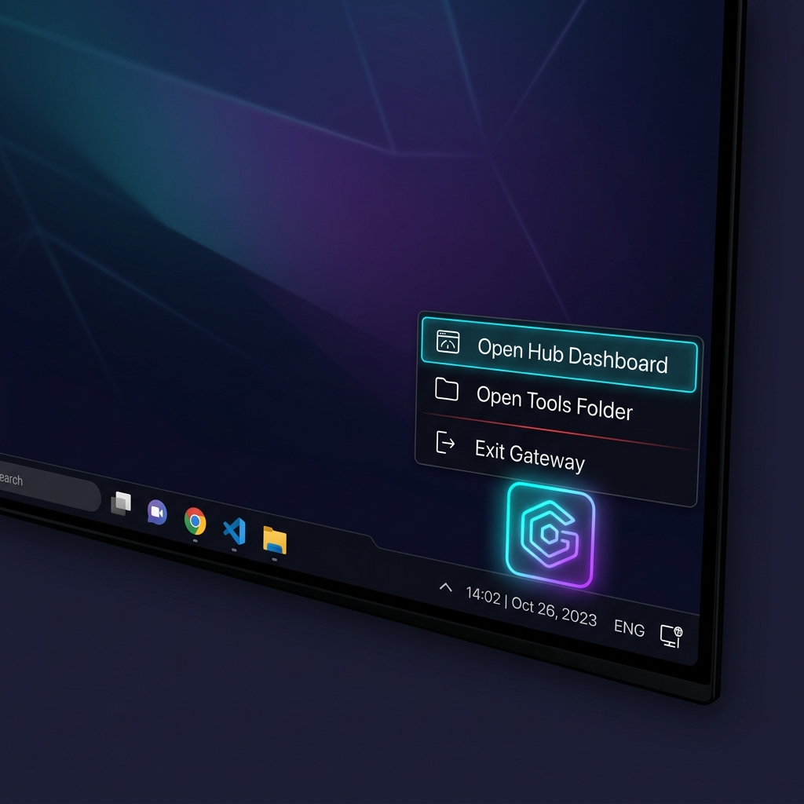

# Universal Local Hub Launcher – Your Personal, Secure Tool Hub

<p align="center"></p>

**Why use the Hub?**
- **Everything stays on your machine.** The launcher never sends data out—your tools run locally, isolated behind the loop‑back interface (`127.0.0.1`).
- **Zero‑admin install.** No system‑wide packages, no Node, no Python. Just download a single executable for Windows, macOS, or Linux and run it.
- **Secure sandbox.** By serving tools via `http://127.0.0.1:8999` we avoid the `file://` protocol and its cookie/local‑storage leakage.
- **Instant discovery.** Drop any single‑file `.html` tool into the `InternalTools` folder and the hub instantly shows a card for it.

---

## 🚀 Quick Start for the Vibe‑Coder
1. **Pick your platform** – scroll down to the *Downloads* section and grab the binary for your OS.
2. **Extract & run** – place the executable anywhere you like, double‑click it. The hub will pop a tiny tray icon (neon cyan‑violet gradient) that you can click for a quick menu:
   - **Open Hub Dashboard** – launches the web UI in your default browser.
   - **Open Tools Folder** – opens the `InternalTools` folder so you can drop new HTML tools.
   - **Exit** – shuts the server down.
3. **Add tools** – copy any `.html` file (e.g., a JSON formatter or a tiny REPL) into the `InternalTools` folder. The dashboard updates automatically.

---

## 📥 Downloads – Grab the Executable
| OS | Asset |
|---|---|
| Windows (64‑bit) | [HubLauncher‑windows‑amd64.exe](https://github.com/Spuds0588/local-hub-launcher/releases/download/v1.0.0/HubLauncher-windows-amd64.exe) |
| macOS (Intel) | [HubLauncher‑mac‑amd64](https://github.com/Spuds0588/local-hub-launcher/releases/download/v1.0.0/HubLauncher-darwin-amd64) |
| macOS (Apple Silicon) | [HubLauncher‑mac‑arm64](https://github.com/Spuds0588/local-hub-launcher/releases/download/v1.0.0/HubLauncher-darwin-arm64) |
| Linux (64‑bit) | [HubLauncher‑linux‑amd64](https://github.com/Spuds0588/local-hub-launcher/releases/download/v1.0.0/HubLauncher-linux-amd64) |

> **Tip:** All binaries are under 12 MB and have no external dependencies.

---

## 🖥️ What the System Tray Looks Like
<p align="center"></p>

The tiny icon lives in your OS tray. Clicking it opens a clean dropdown menu with the three actions listed above. No console window appears (Windows uses `-H=windowsgui`).

---

## 🔐 Security at a Glance
- **Local‑only network.** The server binds only to `127.0.0.1` – nothing leaves your computer.
- **Headers set for safety.** `X-Content-Type-Options: nosniff` and `X-Frame-Options: DENY` prevent click‑jacking or MIME‑type confusion.
- **No background telemetry.** The binary does not contact any external service unless you explicitly open a link.

---

## 🛠️ Building Your Own Version (Optional)
If you like to tinker, the source is on GitHub. The build uses pure‑Go and the `gogpu/systray` library, so cross‑compiling is straightforward:
```bash
# Example – build a Windows binary on any host
GOOS=windows GOARCH=amd64 go build -ldflags="-s -w -H=windowsgui" -o HubLauncher.exe
```

---

## 📄 License
MIT – see the [LICENSE](LICENSE) file.

---

Enjoy a secure, zero‑admin way to keep all your favorite single‑file web tools handy, right from your tray!

<p align="center">
  
</p>

A lightweight, zero-administration desktop application gateway for developer utility tools. It monitors a local directory (`~/InternalTools`) and dynamically maps available single-file HTML apps onto an interactive dashboard served locally on port `8999`.

Built with high-compliance and corporate governance in mind, it operates entirely offline with **zero system runtimes**, binds to the isolated loopback interface, and isolates applications via local browser sandbox controls.

---

## ⚡ Key Features

* **Zero Administration:** Compiles to a single self-contained native binary. No Node.js, Python, or runtime configuration prerequisites required.
* **Ultra Lightweight:** Uses native Go channels. Consumes **<15MB of RAM** and **0% idle CPU**, leaving corporate workstations completely untaxed.
* **Isolated Origin Security:** Bypasses `file://` cookie/local storage leakage. Serves local tools under isolated paths with strict `X-Content-Type-Options: nosniff` and `X-Frame-Options: DENY` headers.
* **Strict Loopback Binding:** Binds strictly to the loopback adapter (`127.0.0.1`). It cannot receive connections from outside networks, nor can it transmit data.
* **Direct File Mapping:** Automatically renders dashboard cards from single-file HTML tools (`.html`) dropped in the monitored workspace folder.

---

## 🚀 Quick Start

1. **Monitored Directory:**
   By default, the launcher maps files from `~/InternalTools` (e.g., `/home/username/InternalTools` or `C:\Users\username\InternalTools`). The application will automatically initialize this directory on start if it does not exist.

2. **Drop HTML Tools:**
   Drop your bundled `.html` tools (e.g., JSON formatters, database viewers, REPLs) into the `InternalTools` folder.

3. **Run the Application:**
   If you have Go installed, execute:
   ```bash
   go run main.go
   ```
   Or execute the compiled binary. The launcher automatically opens your default system browser and redirects to the landing dashboard:
   ```
   http://127.0.0.1:8999/
   ```

---

## 🛠️ Cross-Compilation & Packaging

Compile optimized, stripped binaries for your target deployment architectures:

### Windows (Silent Background Launch)
To prevent a command prompt window from flashing on the user's screen, use the `-H=windowsgui` flag:
```bash
GOOS=windows GOARCH=amd64 go build -ldflags="-s -w -H=windowsgui" -o HubLauncher.exe main.go
```
*The `-s -w` flags strip debugging information to reduce the binary size to ~1-2 MB.*

### macOS (Darwin)
```bash
GOOS=darwin GOARCH=amd64 go build -ldflags="-s -w" -o HubLauncherMac main.go
```

### Linux
```bash
GOOS=linux GOARCH=amd64 go build -ldflags="-s -w" -o HubLauncherLinux main.go
```

---

## 🏢 IT Automated Deployment

For organization-wide rollouts using systems management platforms (such as Microsoft Intune, GPO, Jamf, or PDQ):

1. **Distribute Binary:** Push the compiled binary (e.g. `HubLauncher.exe`) to a read-only local program directory:
   `C:\Program Files\HubLauncher\HubLauncher.exe`
2. **Setup Folder:** Create the user tool directory:
   `C:\Users\%USERNAME%\InternalTools\`
3. **Configure Startup:** Place a shortcut (`.lnk`) pointing to the executable inside the Windows Startup folder to ensure it runs silently on login:
   `C:\ProgramData\Microsoft\Windows\Start Menu\Programs\StartUp\`
4. **Deploy Tools:** Push single-file tools (like `calculator.html`, `json-viewer.html`) into the user's `InternalTools` directory. The launcher will automatically discover them at runtime.

---

## 📄 License

This project is licensed under the MIT License. See the [LICENSE](LICENSE) file for details.
